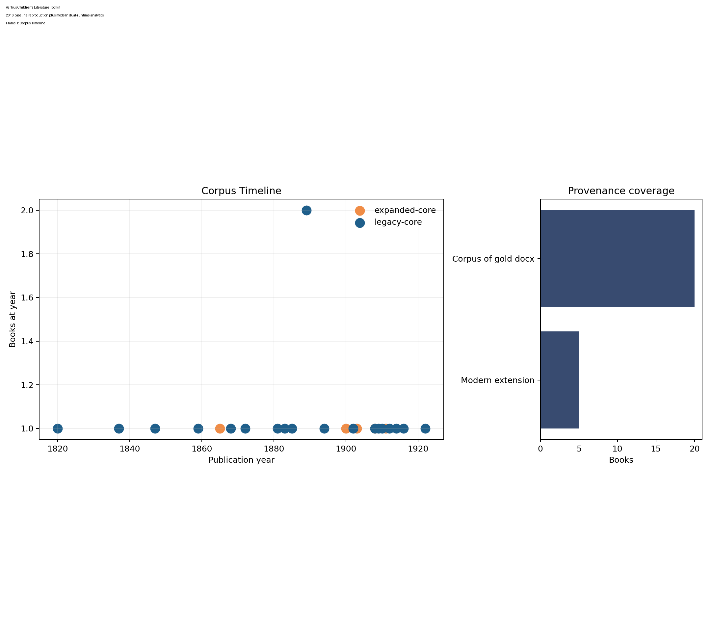

# Aarhus Children's Literature Toolkit



An open, dual-runtime rebuild of a 2016 Aarhus Summer University project on children’s literature. The repository is designed for public release, commercial-friendly local reuse, and reproducible comparison between a 2016 baseline and a 2026 method stack.

## What This Repo Delivers

1. A reproducible reconstruction of the canonical 20-book `Corpus of gold` children’s literature corpus.
2. A documented expansion layer with five additional public-domain titles.
3. First-class R and Python entrypoints over the same manifests, figures, tables, and report outputs.
4. A public-release surface that favors interpretable charts, benchmark tables, and reusable SOP documentation instead of screenshots.

## Quick Start

### 1. Prepare the shared `dl` runtime

```bash
make setup
make bootstrap
```

### 2. Build the generated assets

```bash
make python-assets
make readme
make report
```

### 3. Choose your interface

```bash
make modern
python -m childlit_toolkit modern
```

The full HTML deep-dive report is rendered to [`docs/index.html`](docs/index.html).

## Corpus Snapshot

The rebuilt corpus currently spans **25 books** and about **1,332,482 words**.

| split         | n_books | total_words | median_book_words | mean_book_words | mean_afinn_per_10k | mean_type_token_ratio |
| ------------- | ------- | ----------- | ----------------- | --------------- | ------------------ | --------------------- |
| expanded-core | 5       | 285618      | 60770.0           | 57123.6         | 201.88             | 0.0874                |
| legacy-core   | 20      | 1046864     | 50005.0           | 52343.2         | 169.58             | 0.1353                |

What this means:

- Good: the corpus is already large enough to support meaningful descriptive text mining without leaving the public-domain children’s literature frame.
- Mixed: the corpus is still historically clustered, so claims about time trends should be treated as exploratory.
- Reuse value: future users can replace `config/corpus_seed.csv` and immediately see whether their new corpus is smaller, longer, more imbalanced, or more sentiment-skewed than this baseline.

## Visual Results

### Figure 1. Corpus Timeline


What this means:

- Good: the rebuild now makes historical coverage explicit.
- Mixed: the corpus still leans heavily toward a specific public-domain era.
- Reuse value: this is the first bias check to rerun after changing the corpus seed.

### Figure 2. Provenance Coverage


What this means:

- Good: provenance status is now visible instead of being implied.
- Good: a public release can now show exactly which texts were rebuilt from documented sources.
- Reuse value: future corpus expansions can be audited before they are folded into benchmarks.

### Figure 3. Book Length Distribution


What this means:

- Good: the repo now exposes which books will dominate naive corpus-wide metrics.
- Bad if ignored: long books will distort sentiment, topic, and embedding results unless chunking is handled deliberately.
- Reuse value: this figure tells downstream users whether they need chapter-level or window-level analysis.

### Figure 4. Chunking Risk


What this means:

- Good: the repository now makes long-context processing risk concrete before users choose a model backend.
- Mixed: chunk counts are a preprocessing warning, not an intrinsic literary property.
- Reuse value: this is directly reusable when deciding between full-text, chapter, and windowed product pipelines.

### Figure 5. Author Metadata Balance


What this means:

- Good: metadata balance is now a first-class audit surface rather than an implicit assumption.
- Mixed: the corpus is not neutral by split or author grouping.
- Reuse value: additions to the corpus can be evaluated immediately for representational balance.

### Figure 6. Sentiment Trajectories


What this means:

- Good: sentiment is no longer reduced to one corpus-wide average.
- Mixed: these curves show narrative motion, not literary quality.
- Reuse value: the window-level view is reusable for chapter studies, classroom demos, or downstream product summaries.

### Figure 7. Guided Theme Heatmap


What this means:

- Good: theme prevalence is now inspectable book by book instead of hiding behind one topic list.
- Mixed: this figure is seed-guided and therefore interpretable, but it reflects the configured theme vocabulary.
- Reuse value: users can swap `config/theme_seeds.yml` to build domain-specific thematic dashboards.

### Figure 8. Book Neighborhood Map


What this means:

- Good: the modern layer now shows which books behave similarly in semantic space.
- Mixed: the exact geometry depends on the available embedding backend and reduction path.
- Reuse value: this plot is directly useful for retrieval demos, recommendation prototypes, and corpus debugging.

### Figure 9. Entity Co-occurrence Network


What this means:

- Good: the repo now surfaces recurring entities and relationship structure instead of leaving NER as a TODO.
- Mixed: when GLiNER is unavailable the fallback is deliberately conservative and heuristic.
- Reuse value: users can replace the backend while keeping the same output contract.

### Figure 10. Auxiliary Validation Panel


What this means:

- Good: the local non-core datasets are now used as calibration anchors rather than ignored.
- Good: this keeps `dr_seuss`, Bible/Qur'an, and `LancsBox` materials useful without contaminating the core benchmark.
- Reuse value: this figure is a reusable sanity check when evaluating a new corpus against known reference corpora.

## Recovered 2016 Baseline

| cohort | min    | q1    | median | mean   | q3   | max   | perplexity |
| ------ | ------ | ----- | ------ | ------ | ---- | ----- | ---------- |
| men    | -245.0 | -41.0 | -3.0   | -13.76 | 23.0 | 195.0 | 3369.274   |
| women  | -232.0 | -21.0 | 9.0    | 13.88  | 54.0 | 190.0 | 4628.327   |

What this means:

- Good: the archive still provides a concrete reproduction target rather than just a loose memory of the course project.
- Mixed: the baseline is lexicon-driven and context-insensitive, so it should be preserved as a comparison point, not treated as the last word.
- Reuse value: any future refactor can regression-test against these directions before trusting the modern stack.

## Modern Method and SOTA Framing

| component              | repo_metric                                                   | legacy_2016_baseline                                    | external_reference                              | published_reference_or_sota        | comparability_note                                                                |
| ---------------------- | ------------------------------------------------------------- | ------------------------------------------------------- | ----------------------------------------------- | ---------------------------------- | --------------------------------------------------------------------------------- |
| Sentiment              | afinn-fallback; mean window score 0.02                        | AFINN cohort means: men -13.76 / women 13.88            | distilbert-base-uncased-finetuned-sst-2-english | Official model card only           | No directly comparable literary benchmark in the local archive.                   |
| Topic modeling         | Guided themes + sklearn LDA; mean dominant topic share 0.844  | topicmodels::LDA perplexity men 3,369.3 / women 4,628.3 | bertopic                                        | Method docs only                   | Cross-corpus SOTA numbers are not directly comparable to this literary corpus.    |
| NER                    | heuristic-titlecase; top-10 entity mean density 41.60 per 10k | Incomplete openNLP sketch                               | gliner                                          | Upstream docs                      | Local entity density and co-occurrence are project-specific.                      |
| Embeddings / retrieval | tfidf-fallback; mean top-1 neighbor cosine 0.151              | not available                                           | Qwen/Qwen3-Embedding-0.6B                       | Model card / MTEB-style references | Neighbor quality is corpus-specific; external numbers are only reference context. |

What this means:

- Good: the repo separates project metrics from external reference context instead of pretending every method has a directly comparable literary SOTA number.
- Good: `n/a` is used honestly where no like-for-like benchmark exists.
- Reuse value: downstream users can extend the table with their own labeled evaluation sets without changing the documentation shape.

## Runtime Status

| task      | backend             | status |
| --------- | ------------------- | ------ |
| sentiment | afinn-fallback      | active |
| embedding | tfidf-fallback      | active |
| ner       | heuristic-titlecase | active |

### Backend Availability Snapshot

| module                | status    | purpose                         | detail                                  |
| --------------------- | --------- | ------------------------------- | --------------------------------------- |
| transformers          | available | modern sentiment backend        | import ok                               |
| sentence_transformers | missing   | embedding and retrieval backend | No module named 'sentence_transformers' |
| bertopic              | missing   | embedding topic modeling        | No module named 'bertopic'              |
| gliner                | missing   | local named entity recognition  | No module named 'gliner'                |
| torch                 | available | accelerated local inference     | import ok                               |
| networkx              | available | entity co-occurrence graphing   | import ok                               |

What this means:

- Good: runtime drift is visible in the repo itself.
- Mixed: optional modern modules may still be missing in a fresh environment until users install the heavy backends.
- Reuse value: this keeps support and reproduction discussions concrete.

## Key Tables

### Topic Top Terms

| topic   | top_terms                                                 |
| ------- | --------------------------------------------------------- |
| topic_1 | mary, th, garden, captain, mother, jem, doctor, martha    |
| topic_2 | jo, amy, mother, mr, aunt, mrs, girls, miss               |
| topic_3 | katy, diamond, trot, peter, cap, blue, mother, button     |
| topic_4 | dorothy, alice, oz, scarecrow, lion, woodman, tin, rabbit |
| topic_5 | edward, polly, mrs, ben, pepper, jacob, cottage, jasper   |
| topic_6 | anne, toad, diana, mrs, rat, matthew, mole, mr            |

### Retrieval Examples

| title                            | neighbor_1                  | neighbor_1_score | neighbor_2                       | neighbor_2_score | neighbor_3                  | neighbor_3_score |
| -------------------------------- | --------------------------- | ---------------- | -------------------------------- | ---------------- | --------------------------- | ---------------- |
| Alice's Adventures in Wonderland | The Velveteen Rabbit        | 0.2181           | Little Women                     | 0.1469           | The Wonderful Wizard of Oz  | 0.1391           |
| The Wonderful Wizard of Oz       | The Emerald City of Oz      | 0.2092           | Little Women                     | 0.173            | What Katy Did               | 0.1499           |
| Rebecca of Sunnybrook Farm       | What Katy Did               | 0.1349           | The Land of the Blue Flower      | 0.1304           | The Secret Garden           | 0.1271           |
| The Wind in the Willows          | Little Women                | 0.1315           | Alice's Adventures in Wonderland | 0.127            | The Wonderful Wizard of Oz  | 0.118            |
| The Secret Garden                | What Katy Did               | 0.1324           | We and the World, Part I         | 0.1298           | The Land of the Blue Flower | 0.1297           |
| Sleepy Hollow                    | The Land of the Blue Flower | 0.1247           | What Katy Did                    | 0.1214           | We and the World, Part I    | 0.1085           |

### Entity Leaderboard

| entity  | total_count | mean_per_10k |
| ------- | ----------- | ------------ |
| Mrs     | 493         | 8.51         |
| Polly   | 459         | 65.57        |
| Diamond | 375         | 140.26       |
| Dorothy | 327         | 36.37        |
| Jacob   | 220         | 19.21        |
| Katy    | 217         | 43.37        |
| Mowgli  | 195         | 37.25        |
| Trot    | 185         | 33.42        |
| Bill    | 181         | 11.35        |
| Mary    | 172         | 20.68        |

### Auxiliary Validation Summary

| source         | word_count | type_token_ratio | sentence_count | afinn_per_10k |
| -------------- | ---------- | ---------------- | -------------- | ------------- |
| dr_seuss       | 804        | 0.0684           | 127            | 1144.28       |
| kjv            | 793119     | 0.0166           | 30031          | 70.58         |
| koran          | 161130     | 0.0448           | 7376           | 182.77        |
| j_hansen       | 185        | 0.1297           | 7              | 0.0           |
| lancsbox_brown | 861989     | 0.0446           | 50629          | 121.66        |
| lancsbox_lob   | 1018723    | 0.0389           | 59133          | 124.39        |

### Dependency and License Audit

| component               | kind           | declared_license                | verification_state    | commercial_note                                                                   | source                                                                            |
| ----------------------- | -------------- | ------------------------------- | --------------------- | --------------------------------------------------------------------------------- | --------------------------------------------------------------------------------- |
| Repository source       | repo           | Apache-2.0                      | verified-local        | Permissive for code reuse with notice retention.                                  | LICENSE                                                                           |
| Project Gutenberg texts | data           | Public domain / Gutenberg terms | manual-check-required | Keep provenance and confirm title-level status before redistribution bundles.     | https://www.gutenberg.org/                                                        |
| GLiNER                  | model-backend  | Apache-2.0                      | upstream-docs         | Safe default when installed, but verify model-card terms before shipping weights. | https://github.com/urchade/GLiNER                                                 |
| BERTopic                | python-package | MIT                             | upstream-docs         | Optional analysis backend.                                                        | https://maartengr.github.io/BERTopic/                                             |
| Qwen3-Embedding-0.6B    | model-backend  | Check model card                | manual-check-required | Use locally, but do not redistribute weights without checking upstream terms.     | https://huggingface.co/Qwen/Qwen3-Embedding-0.6B                                  |
| DistilBERT SST-2        | model-backend  | Apache-2.0                      | model-card            | Default sentiment backend when available.                                         | https://huggingface.co/distilbert/distilbert-base-uncased-finetuned-sst-2-english |

What this means:

- Good: the repo is now publishable as a reusable toolkit rather than a folder of scripts.
- Mixed: model and corpus redistribution still require title-level and model-card checks, so the audit deliberately marks uncertain items instead of overclaiming.
- Reuse value: this table is the operational handoff for public/commercial review.

## Project Layout

- `R/`: R-side wrappers, targets pipeline, and report helpers.
- `childlit_toolkit/`: first-class Python CLI and asset-generation pipeline.
- `config/`: corpus seed, theme seeds, and method references.
- `data/manifests/`: shared manifests and run-status outputs.
- `results/`: figures, tables, fragments, and demo assets.
- `docs/`: Quarto report source and rendered HTML.
- `.github/workflows/`: public CI for the release path.

## Public Release Notes

- Target repository: `bozliu/aarhus-childrens-literature-toolkit`
- First public tag: `v0.1.0`
- Main release assets: corpus manifest, benchmark tables, HTML report, GIF/MP4 demo, and release bundle manifest.

## References

[1] Project Gutenberg, "Project Gutenberg," 2026. [Online]. Available: https://www.gutenberg.org/

[2] F. Å. Nielsen, "AFINN," GitHub repository, 2011-. [Online]. Available: https://github.com/fnielsen/afinn

[3] K. Benoit et al., "quanteda," 2026. [Online]. Available: https://quanteda.io/

[4] Posit, "reticulate," 2026. [Online]. Available: https://rstudio.github.io/reticulate/

[5] M. E. Roberts, B. M. Stewart, and D. Tingley, "stm: R Package for Structural Topic Models," 2026. [Online]. Available: https://search.r-project.org/CRAN/refmans/stm/html/stm-package.html

[6] S. Eshima et al., "keyATM," 2026. [Online]. Available: https://keyatm.github.io/keyATM/

[7] M. Grootendorst, "BERTopic Documentation," 2026. [Online]. Available: https://maartengr.github.io/BERTopic/

[8] U. Zaratiana et al., "GLiNER," GitHub repository, 2026. [Online]. Available: https://github.com/urchade/GLiNER

[9] Qwen Team, "Qwen3-Embedding-0.6B," Hugging Face model card, 2026. [Online]. Available: https://huggingface.co/Qwen/Qwen3-Embedding-0.6B

[10] Hugging Face, "distilbert-base-uncased-finetuned-sst-2-english," model card, 2026. [Online]. Available: https://huggingface.co/distilbert/distilbert-base-uncased-finetuned-sst-2-english
