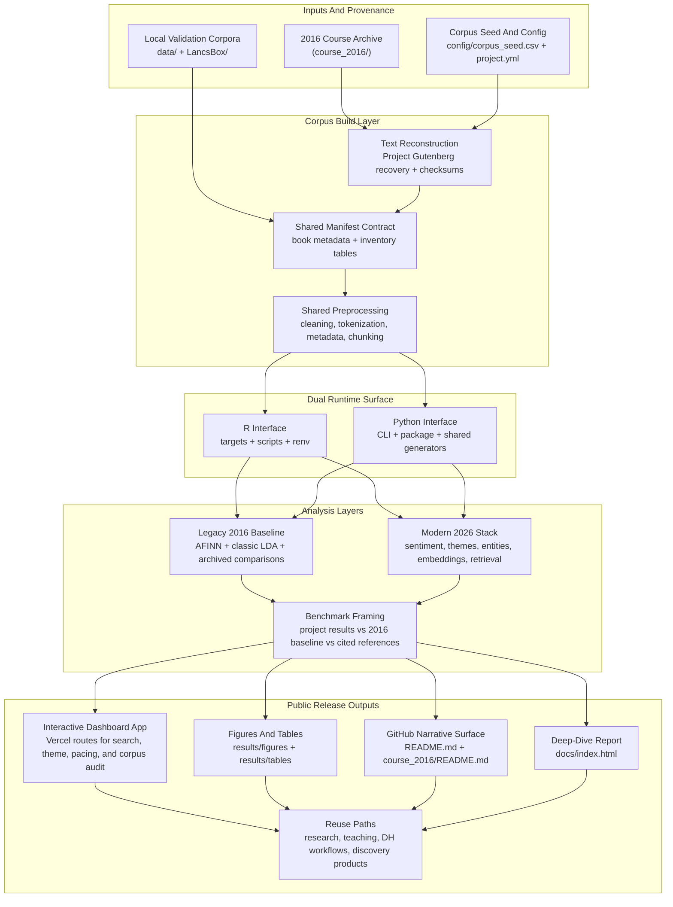

# Aarhus Children's Literature Toolkit


An open, dual-runtime rebuild of a 2016 Aarhus Summer University project on children’s literature. The repository is now framed as a dashboard-first discovery product for Libraries & EdTech, with recommendation/discovery as one feature layer inside a broader children’s literature intelligence workflow.

## What This Repo Delivers

1. A reproducible reconstruction of the canonical 20-book `Corpus of gold` children’s literature corpus.
2. A documented expansion layer with five additional public-domain titles.
3. First-class R and Python entrypoints over the same manifests, figures, tables, and report outputs.
4. A public-release surface that favors interpretable charts, benchmark tables, and reusable SOP documentation instead of screenshots.

## Live Dashboard

- Public app: [https://aarhus-childrens-literature-toolkit.vercel.app](https://aarhus-childrens-literature-toolkit.vercel.app)
- Overview route: [https://aarhus-childrens-literature-toolkit.vercel.app/dashboard](https://aarhus-childrens-literature-toolkit.vercel.app/dashboard)
- Title search: [https://aarhus-childrens-literature-toolkit.vercel.app/explorer](https://aarhus-childrens-literature-toolkit.vercel.app/explorer)
- Theme analysis: [https://aarhus-childrens-literature-toolkit.vercel.app/themes](https://aarhus-childrens-literature-toolkit.vercel.app/themes)
- Sentiment arcs: [https://aarhus-childrens-literature-toolkit.vercel.app/sentiment](https://aarhus-childrens-literature-toolkit.vercel.app/sentiment)
- Corpus audit: [https://aarhus-childrens-literature-toolkit.vercel.app/corpus](https://aarhus-childrens-literature-toolkit.vercel.app/corpus)
- Methodology report: [https://aarhus-childrens-literature-toolkit.vercel.app/report](https://aarhus-childrens-literature-toolkit.vercel.app/report)

## Who This Is For

- Libraries and reading platforms that need better title discovery than age bands and manual tagging alone.
- EdTech and curriculum teams that want interpretable signals for themed reading lists, classroom comparison, and catalog exploration.
- Title-discovery teams who need similarity lookup, theme profiles, sentiment pacing, and corpus audit in one surface.

## What Problem It Solves

- Children’s books are often cataloged with sparse metadata, broad age labels, and inconsistent subject tags, which makes related-title discovery shallow and hard to explain.
- Manual browsing can find a few obvious comparisons, but it does not scale well across dozens of books when a librarian or product team needs to compare theme, pacing, character prominence, and corpus bias together.
- This repo turns a children’s literature corpus into a structured comparison surface so teams can move from “find books manually” to “inspect books systematically.”

## What Decisions It Helps You Make

- Which books should appear as related-title neighbors when a reader, librarian, or curator starts from one known title.
- Which titles fit friendship, family, growth, fantasy, adventure, or animal-centered reading lists.
- Which books are calmer versus more turbulent in narrative pacing, and therefore better suited to different reading experiences or classroom uses.
- Where the current catalog is historically clustered, imbalanced, or over-dependent on a narrow canonical slice.

## Why Children’s Literature

- Children’s literature is culturally foundational: it shapes early reading habits, moral vocabularies, character archetypes, and shared narrative worlds.
- It is analytically strong for text mining because the books often contain clear story arcs, recurring character systems, theme-rich plots, and accessible language patterns that are easy to interpret in discovery and dashboard settings.
- It works well as an R text-mining case because the outputs are legible to non-technical readers, which matters for librarians, teachers, and public-facing reading products.
- The public-domain corpus makes the workflow reproducible, legally shareable, and easy to reuse in catalog navigation, reading-list curation, and digital-humanities teaching.

## Why The 20-Book Legacy Corpus Matters

- The legacy baseline stays at **20 books** because that is the canonical corpus defined in the original `Corpus of gold` course documents, so keeping those titles intact preserves historical comparability with the 2016 final project and gives the dashboard a trusted benchmark layer.
- Twenty books is small enough to audit title by title, metadata row by metadata row, and provenance source by provenance source, which matters for a public digital-humanities workflow.
- At the same time, those 20 books are large enough to support corpus-level analysis: the current rebuilt legacy core contains **20 books and 1,046,864 words**, which is enough to expose differences in sentiment, theme prevalence, named entities, and narrative structure across books for dashboard comparison.
- The modern release expands beyond that baseline with 5 extra books, but the 20-book set remains the anchor corpus because it is the cleanest bridge between course history, reproducibility, and present-day reuse in a live discovery product.

## What We Learn From The Analysis

- The rebuilt corpus is useful but not neutral: the current public release covers **25 books and 1,332,482 words**, while the legacy core remains historically clustered around a public-domain Anglo-American canon. For a dashboard product, that means the corpus is best read as a canon-aware benchmark and collection-audit surface, not as a universal map of all children’s literature.
- Book neighborhoods are meaningful enough to support discovery workflows. The similarity outputs place `The Wonderful Wizard of Oz` near `The Emerald City of Oz`, while `Little Women` sits closer to `Anne of Green Gables` and `Peter Pan`, which is exactly the kind of interpretable neighboring structure that libraries and reading products can reuse.
- Character prominence is one of the clearest signals in this corpus. The entity outputs are dominated by recurring named characters such as Dorothy, Wendy, Polly, and Mowgli, which makes the dashboard particularly useful for character-driven reading comparison and classroom discussion design.
- Theme profiles are readable at the title level rather than only at the corpus level. The guided theme layer makes it practical to contrast family, growth, fantasy, adventure, animals, and moral-emotion signals book by book when building lists or comparing shelves.
- Book length varies enough to become an implementation constraint. Some titles are long enough to distort naive full-text averages, so chunking and windowed analysis are not optional engineering details; they are required if the dashboard is going to compare books fairly.
- Sentiment trajectories are more informative than one global score. They behave best as discovery features for narrative pacing rather than as proxies for quality, which is why they fit a dashboard product better than a forecasting claim.

## What This Repo Can And Cannot Tell You

- It **can** tell you how books compare across theme, sentiment movement, recurring entities, lexical patterns, and semantic similarity. In product terms, it already works as a children’s literature comparison and discovery layer.
- It **can** help you inspect corpus bias and benchmark a new title or corpus against a historically grounded public-domain baseline.
- It **cannot yet** reliably predict future story events, endings, or “what happens next” in a strong forecasting sense. The current pipeline is descriptive, comparative, and retrieval-oriented rather than trained as a chapter-by-chapter predictive model, so it should not be sold as a story predictor.
- It **does not** claim to score literary quality, educational value, pedagogy quality, or sales potential directly. Those would require new labels, user data, and product-specific evaluation loops that are outside the present repo.

## Commercial Value And Product Direction

- The honest near-term product is a **children’s literature discovery dashboard** for Libraries & EdTech, not a general story-trajectory predictor and not a standalone recommendation engine.
- Recommendation belongs inside that dashboard as one feature layer alongside theme profiles, sentiment pacing, character prominence, and catalog audit.
- For libraries, reading platforms, and curriculum teams, this product direction is already defensible because the repo can turn a raw corpus into concrete discovery and curation signals.
- For research groups, museums, and digital-humanities labs, the same repo remains useful as a reusable evidence surface and methodologically transparent SOP.
- If this repo becomes a product, the clearest MVP is a searchable dashboard with title lookup, similar-book navigation, theme profile panels, sentiment arc views, and corpus-level audit panels. Stronger predictive features should only come after sequence-aware modeling and evaluation exist.

## Capability Map

| Dashboard capability | Product question it answers |
| -------------------- | --------------------------- |
| Similarity lookup | If a reader likes one title, which neighboring books should a librarian or reading platform inspect next? |
| Theme profiles | Which books fit friendship, family, growth, fantasy, adventure, or animal-centered reading lists? |
| Sentiment arcs | Which books have calmer versus more turbulent narrative pacing? |
| Entity density / character prominence | Which books are strongly character-driven for discussion, curriculum design, or reader-facing comparisons? |
| Corpus audit | Where is the catalog historically biased, over-clustered, or too narrow to support broader claims? |

Libraries and EdTech teams do not buy a topic model for its own sake. They buy better discovery, curation, list-building, and catalog interpretation. The repo’s practical value is that it turns raw books into those decision surfaces without pretending that the current stack already predicts literary success or future plot events.

## 2016 Course Archive

The historical Aarhus course materials now live in [`course_2016/README.md`](course_2016/README.md). That folder keeps the 2016 slides, teaching code, project work, supporting resources, and raw archives in one browsable place so the public repo can stay product-first at the top level without losing provenance.

## Workflow Architecture



## What It Is

This repository is a public children’s literature analysis toolkit built from a 2016 Aarhus Summer University project. It reconstructs the original Gutenberg-based corpus [1], keeps the legacy baseline visible, and wraps modern local text-mining workflows around the same materials so that the project can be reused outside the classroom.

## Why It Matters

- Many humanities or classroom text-mining projects stop at notebooks, slides, or one-off scripts, which makes them hard to verify, reuse, or productize.
- Many modern NLP libraries and model repos provide strong components, but they usually stop at the method or model level rather than shipping a domain-ready literary workflow [3]-[10].
- This repo turns a historically interesting but fragile course project into a repeatable public asset with manifests, figures, tables, demos, CI, and release-ready documentation.

## What Solution It Provides

| Problem | This repo's solution |
| ------- | -------------------- |
| The original 2016 project is historically valuable but hard to rerun exactly. | Reconstruct the canonical corpus, recover the legacy sentiment/topic baseline, and preserve it as a regression target. |
| Modern NLP tools are powerful but difficult to adapt cleanly to a humanities corpus. | Provide one shared contract for corpus manifests, figures, benchmark tables, and reports, with R and Python entrypoints over the same outputs. |
| Public readers often cannot tell what a text-mining chart means or whether it is useful. | Put interpretation directly under each figure and table: what it shows, whether it is good/bad/mixed, and how to reuse it. |
| Teams who want to turn a corpus project into a reusable product usually have to invent their own SOP. | Ship a ready-made SOP for corpus reconstruction, benchmarking, visualization, release assets, and GitHub publication. |

## Why It Is Different From Related Work

| Related work | Strong at | Typical gap for public reuse | What is unique here |
| ------------ | --------- | ---------------------------- | ------------------- |
| `quanteda` and `reticulate` [3], [4] | Core text-analysis infrastructure and R/Python interoperability | They are foundations, not a domain-specific public product by themselves. | This repo turns those building blocks into a children’s literature workflow with stable outputs and release artifacts. |
| `stm`, `keyATM`, and `BERTopic` [5]-[7] | Topic modeling methods, metadata-aware modeling, and embedding-driven topic discovery | They focus on modeling techniques, not on preserving a legacy humanities baseline and publishing a full benchmark story. | This repo compares legacy 2016 methods with modern topic layers inside one literary corpus and one report surface. |
| `GLiNER`, `Qwen3-Embedding-0.6B`, and DistilBERT SST-2 [8]-[10] | Local NER, embeddings, and sentiment backends | They provide model capabilities, not corpus reconstruction, visualization standards, or product-facing SOPs. | This repo converts model outputs into reusable book-level tables, entity networks, retrieval examples, and README/report assets. |
| Many course-project repositories | Preserving scripts, lecture materials, and exploratory analysis | They are often hard to rerun, hard to compare across methods, and hard for the public to interpret. | This repo is designed as a public release: benchmark framing, demo media, CI, community files, and commercial-facing reuse guidance are part of the deliverable. |

The uniqueness here is workflow-level rather than claiming a new universal model SOTA. The repo is meant to make modern local methods practical, inspectable, and reusable for children’s literature, not to overclaim state-of-the-art results on unrelated benchmark suites.

## How The Public Can Reuse It

- Researchers can swap `config/corpus_seed.csv`, rerun the pipeline, and reuse the same reporting structure for a new literary corpus.
- Teachers can use the legacy-versus-modern comparison to show how text mining methods changed between 2016 and the current stack.
- Product teams can reuse the sentiment windows, theme heatmaps, entity networks, and retrieval tables as a starting point for recommendation, discovery, or editorial tooling.
- Open-source maintainers can reuse the SOP pattern itself: corpus manifest, benchmark framing, figure interpretation, release media, and GitHub automation.

## Quick Start

### 1. Prepare the shared `dl` runtime

```bash
make setup
make bootstrap
```

### 2. Build the generated assets

```bash
make python-assets
make readme
make report
```

### 3. Choose your interface

```bash
make modern
python -m childlit_toolkit modern
```

The full HTML deep-dive report is rendered to [`docs/index.html`](docs/index.html), while the public dashboard lives at [https://aarhus-childrens-literature-toolkit.vercel.app](https://aarhus-childrens-literature-toolkit.vercel.app).

## Corpus Snapshot

The rebuilt corpus currently spans **25 books** and about **1,332,482 words**.

| split         | n_books | total_words | median_book_words | mean_book_words | mean_afinn_per_10k | mean_type_token_ratio |
| ------------- | ------- | ----------- | ----------------- | --------------- | ------------------ | --------------------- |
| expanded-core | 5       | 285618      | 60770.0           | 57123.6         | 201.88             | 0.0874                |
| legacy-core   | 20      | 1046864     | 50005.0           | 52343.2         | 169.58             | 0.1353                |

What this means:

- Good: the corpus is already large enough to support meaningful descriptive text mining without leaving the public-domain children’s literature frame.
- Mixed: the corpus is still historically clustered, so claims about time trends should be treated as exploratory.
- Reuse value: future users can replace `config/corpus_seed.csv` and immediately see whether their new corpus is smaller, longer, more imbalanced, or more sentiment-skewed than this baseline.

## Visual Results

### Figure 1. Corpus Timeline


What this means:

- Signal: this shows where the catalog is historically concentrated instead of pretending the corpus is time-neutral.
- Decision: a librarian, platform team, or curator can use this to decide whether the collection needs balancing before treating it as representative.
- Limit: timeline coverage reflects this curated public-domain corpus, not the full field of children’s literature.

### Figure 2. Provenance Coverage


What this means:

- Signal: this makes source provenance visible title by title, which is essential for a trustworthy public dashboard.
- Decision: teams can decide whether a title is stable enough to include in benchmark or discovery views before exposing it to users.
- Limit: provenance quality does not automatically guarantee textual quality or annotation completeness.

### Figure 3. Book Length Distribution


What this means:

- Signal: this shows which books are long enough to dominate naive whole-corpus summaries.
- Decision: product teams can decide whether comparisons should be full-text, chapter-level, or windowed before using the dashboard outputs downstream.
- Limit: length is an implementation and comparability factor, not a proxy for difficulty or literary value.

### Figure 4. Chunking Risk


What this means:

- Signal: this turns context-window risk into a visible processing constraint for each book.
- Decision: it supports a concrete choice between full-text, chapter, and windowed dashboard pipelines.
- Limit: chunk counts depend on preprocessing and model context length, so they are engineering warnings rather than literary claims.

### Figure 5. Author Metadata Balance


What this means:

- Signal: this exposes where the current catalog is imbalanced instead of hiding representation assumptions.
- Decision: curators can use it to decide where to expand or rebalance a collection before presenting it as broadly representative.
- Limit: metadata balance is only as good as the available metadata fields and the current corpus scope.

### Figure 6. Sentiment Trajectories


What this means:

- Signal: this shows narrative pacing as a curve rather than collapsing a book into one score.
- Decision: reading platforms and educators can compare calmer versus more turbulent books when shaping reading lists or classroom contrast sets.
- Limit: sentiment movement is a pacing feature, not a measure of literary quality or reader satisfaction.

### Figure 7. Guided Theme Heatmap


What this means:

- Signal: this reveals title-level theme profiles that are useful for reading-list and shelf-design work.
- Decision: a librarian or curriculum team can decide which books best fit family, growth, fantasy, adventure, animal, or moral-emotion collections.
- Limit: the chart is seed-guided, so it reflects the configured theme vocabulary rather than a universal ontology of children’s literature.

### Figure 8. Book Neighborhood Map


What this means:

- Signal: this makes related-title neighborhoods visible instead of forcing discovery to depend on flat subject tags.
- Decision: reading platforms and librarians can use it for related-book navigation, similarity lookup, and recommendation explainability.
- Limit: the map is not personalized and its geometry depends on the embedding backend and reduction method.

### Figure 9. Entity Co-occurrence Network


What this means:

- Signal: this shows whether a book is strongly character-driven and which names dominate its narrative surface.
- Decision: teachers, librarians, and reading-product teams can use it to identify texts suited to character-centered discussion or comparison.
- Limit: when GLiNER is unavailable, the fallback is deliberately conservative and heuristic rather than full NER.

### Figure 10. Auxiliary Validation Panel


What this means:

- Signal: this shows how the core children’s literature corpus behaves relative to known local reference corpora.
- Decision: it helps teams sanity-check whether a new dashboard corpus looks unusually narrow, noisy, or skewed before productizing it.
- Limit: these are calibration references, not direct substitutes for the core benchmark corpus.

## Recovered 2016 Baseline

| cohort | min    | q1    | median | mean   | q3   | max   | perplexity |
| ------ | ------ | ----- | ------ | ------ | ---- | ----- | ---------- |
| men    | -245.0 | -41.0 | -3.0   | -13.76 | 23.0 | 195.0 | 3369.274   |
| women  | -232.0 | -21.0 | 9.0    | 13.88  | 54.0 | 190.0 | 4628.327   |

What this means:

- Good: the archive still provides a concrete reproduction target rather than just a loose memory of the course project.
- Mixed: the baseline is lexicon-driven and context-insensitive, so it should be preserved as a comparison point, not treated as the last word.
- Reuse value: any future refactor can regression-test against these directions before trusting the modern stack.

## Modern Method and SOTA Framing

| component              | repo_metric                                                   | legacy_2016_baseline                                    | external_reference                              | published_reference_or_sota        | comparability_note                                                                |
| ---------------------- | ------------------------------------------------------------- | ------------------------------------------------------- | ----------------------------------------------- | ---------------------------------- | --------------------------------------------------------------------------------- |
| Sentiment              | afinn-fallback; mean window score 0.02                        | AFINN cohort means: men -13.76 / women 13.88            | distilbert-base-uncased-finetuned-sst-2-english | Official model card only           | No directly comparable literary benchmark in the local archive.                   |
| Topic modeling         | Guided themes + sklearn LDA; mean dominant topic share 0.844  | topicmodels::LDA perplexity men 3,369.3 / women 4,628.3 | bertopic                                        | Method docs only                   | Cross-corpus SOTA numbers are not directly comparable to this literary corpus.    |
| NER                    | heuristic-titlecase; top-10 entity mean density 41.60 per 10k | Incomplete openNLP sketch                               | gliner                                          | Upstream docs                      | Local entity density and co-occurrence are project-specific.                      |
| Embeddings / retrieval | tfidf-fallback; mean top-1 neighbor cosine 0.151              | not available                                           | Qwen/Qwen3-Embedding-0.6B                       | Model card / MTEB-style references | Neighbor quality is corpus-specific; external numbers are only reference context. |

What this means:

- Good: the repo separates project metrics from external reference context instead of pretending every method has a directly comparable literary SOTA number.
- Good: `n/a` is used honestly where no like-for-like benchmark exists.
- Reuse value: downstream users can extend the table with their own labeled evaluation sets without changing the documentation shape.

## Runtime Status

| task      | backend             | status |
| --------- | ------------------- | ------ |
| sentiment | afinn-fallback      | active |
| embedding | tfidf-fallback      | active |
| ner       | heuristic-titlecase | active |

### Backend Availability Snapshot

| module                | status    | purpose                         | detail                                  |
| --------------------- | --------- | ------------------------------- | --------------------------------------- |
| transformers          | available | modern sentiment backend        | import ok                               |
| sentence_transformers | missing   | embedding and retrieval backend | No module named 'sentence_transformers' |
| bertopic              | missing   | embedding topic modeling        | No module named 'bertopic'              |
| gliner                | missing   | local named entity recognition  | No module named 'gliner'                |
| torch                 | available | accelerated local inference     | import ok                               |
| networkx              | available | entity co-occurrence graphing   | import ok                               |

What this means:

- Good: runtime drift is visible in the repo itself.
- Mixed: optional modern modules may still be missing in a fresh environment until users install the heavy backends.
- Reuse value: this keeps support and reproduction discussions concrete.

## Key Tables

### Topic Top Terms

| topic   | top_terms                                                 |
| ------- | --------------------------------------------------------- |
| topic_1 | mary, th, garden, captain, mother, jem, doctor, martha    |
| topic_2 | jo, amy, mother, mr, aunt, mrs, girls, miss               |
| topic_3 | katy, diamond, trot, peter, cap, blue, mother, button     |
| topic_4 | dorothy, alice, oz, scarecrow, lion, woodman, tin, rabbit |
| topic_5 | edward, polly, mrs, ben, pepper, jacob, cottage, jasper   |
| topic_6 | anne, toad, diana, mrs, rat, matthew, mole, mr            |

### Retrieval Examples

| title                            | neighbor_1                  | neighbor_1_score | neighbor_2                       | neighbor_2_score | neighbor_3                  | neighbor_3_score |
| -------------------------------- | --------------------------- | ---------------- | -------------------------------- | ---------------- | --------------------------- | ---------------- |
| Alice's Adventures in Wonderland | The Velveteen Rabbit        | 0.2181           | Little Women                     | 0.1469           | The Wonderful Wizard of Oz  | 0.1391           |
| The Wonderful Wizard of Oz       | The Emerald City of Oz      | 0.2092           | Little Women                     | 0.173            | What Katy Did               | 0.1499           |
| Rebecca of Sunnybrook Farm       | What Katy Did               | 0.1349           | The Land of the Blue Flower      | 0.1304           | The Secret Garden           | 0.1271           |
| The Wind in the Willows          | Little Women                | 0.1315           | Alice's Adventures in Wonderland | 0.127            | The Wonderful Wizard of Oz  | 0.118            |
| The Secret Garden                | What Katy Did               | 0.1324           | We and the World, Part I         | 0.1298           | The Land of the Blue Flower | 0.1297           |
| Sleepy Hollow                    | The Land of the Blue Flower | 0.1247           | What Katy Did                    | 0.1214           | We and the World, Part I    | 0.1085           |

### Entity Leaderboard

| entity  | total_count | mean_per_10k |
| ------- | ----------- | ------------ |
| Mrs     | 493         | 8.51         |
| Polly   | 459         | 65.57        |
| Diamond | 375         | 140.26       |
| Dorothy | 327         | 36.37        |
| Jacob   | 220         | 19.21        |
| Katy    | 217         | 43.37        |
| Mowgli  | 195         | 37.25        |
| Trot    | 185         | 33.42        |
| Bill    | 181         | 11.35        |
| Mary    | 172         | 20.68        |

### Auxiliary Validation Summary

| source         | word_count | type_token_ratio | sentence_count | afinn_per_10k |
| -------------- | ---------- | ---------------- | -------------- | ------------- |
| dr_seuss       | 804        | 0.0684           | 127            | 1144.28       |
| kjv            | 793119     | 0.0166           | 30031          | 70.58         |
| koran          | 161130     | 0.0448           | 7376           | 182.77        |
| j_hansen       | 185        | 0.1297           | 7              | 0.0           |
| lancsbox_brown | 861989     | 0.0446           | 50629          | 121.66        |
| lancsbox_lob   | 1018723    | 0.0389           | 59133          | 124.39        |

### Dependency and License Audit

| component               | kind           | declared_license                | verification_state    | commercial_note                                                                   | source                                                                            |
| ----------------------- | -------------- | ------------------------------- | --------------------- | --------------------------------------------------------------------------------- | --------------------------------------------------------------------------------- |
| Repository source       | repo           | Apache-2.0                      | verified-local        | Permissive for code reuse with notice retention.                                  | LICENSE                                                                           |
| Project Gutenberg texts | data           | Public domain / Gutenberg terms | manual-check-required | Keep provenance and confirm title-level status before redistribution bundles.     | https://www.gutenberg.org/                                                        |
| GLiNER                  | model-backend  | Apache-2.0                      | upstream-docs         | Safe default when installed, but verify model-card terms before shipping weights. | https://github.com/urchade/GLiNER                                                 |
| BERTopic                | python-package | MIT                             | upstream-docs         | Optional analysis backend.                                                        | https://maartengr.github.io/BERTopic/                                             |
| Qwen3-Embedding-0.6B    | model-backend  | Check model card                | manual-check-required | Use locally, but do not redistribute weights without checking upstream terms.     | https://huggingface.co/Qwen/Qwen3-Embedding-0.6B                                  |
| DistilBERT SST-2        | model-backend  | Apache-2.0                      | model-card            | Default sentiment backend when available.                                         | https://huggingface.co/distilbert/distilbert-base-uncased-finetuned-sst-2-english |

What this means:

- Good: the repo is now publishable as a reusable toolkit rather than a folder of scripts.
- Mixed: model and corpus redistribution still require title-level and model-card checks, so the audit deliberately marks uncertain items instead of overclaiming.
- Reuse value: this table is the operational handoff for public/commercial review.

## Repository Tree

```text
.
├── README.md                  # generated public homepage for the GitHub repo
├── README.Rmd                 # R-facing note pointing to the shared README generation flow
├── Prompt.md                  # durable memory: current task specification
├── Plan.md                    # durable memory: milestone plan and acceptance criteria
├── Implement.md               # durable memory: execution runbook
├── Documentation.md           # durable memory: live status, decisions, and validation log
├── LICENSE                    # Apache-2.0 license for the repository source
├── NOTICE                     # release notice and attribution surface
├── CITATION.cff               # machine-readable citation metadata
├── CONTRIBUTING.md            # contributor guidance for public reuse
├── CODE_OF_CONDUCT.md         # community conduct policy
├── SECURITY.md                # security disclosure policy
├── Makefile                   # language-neutral convenience commands
├── pyproject.toml             # Python packaging and CLI metadata
├── DESCRIPTION                # R package metadata
├── _targets.R                 # optional R targets entrypoint
├── renv.lock                  # pinned R dependency lockfile
├── vercel.json                # Vercel project metadata for the public deployment
├── .gitignore                 # git ignore policy, including local-only clutter
├── .vercelignore              # deploy filter so Vercel ships the deployment surface instead of the full workspace
├── .Rbuildignore              # R build exclusions
├── .Rprofile                  # project-level R startup behavior
├── .github/                   # CI and release workflows
├── site/                      # Figma-inspired static front-end served by Vercel
│   ├── index.html             # product landing page
│   ├── dashboard/             # overview route with quick-start and KPI surfaces
│   ├── explorer/              # searchable title explorer and similarity detail pane
│   ├── themes/                # theme-led reading-list and comparison route
│   ├── sentiment/             # narrative pacing comparison route
│   ├── corpus/                # provenance, diversity, and collection-audit route
│   ├── data/                  # generated JSON payload consumed by the front-end
│   └── assets/                # shared CSS and JavaScript for the live dashboard
├── public/                    # deploy-ready static output synced from site/ and docs/
├── R/                         # R wrappers, utilities, and reporting helpers
│   ├── manifests.R            # shared manifest/inventory helpers used by the R interface
│   ├── legacy.R               # R-side helpers for reproducing the 2016 baseline workflow
│   ├── modern.R               # R-side wrappers for the modern analysis flow
│   └── reporting.R            # R-side helpers for rendering and asset orchestration
├── childlit_toolkit/          # Python CLI and shared asset-generation pipeline
│   ├── __main__.py            # `python -m childlit_toolkit` command entrypoint
│   └── pipeline.py            # core generator for manifests, figures, tables, README, and report assets
├── config/                    # corpus seed, theme seeds, and project settings
│   ├── corpus_seed.csv        # canonical children’s literature book list for rebuilding the corpus
│   ├── project.yml            # single source of truth for paths, runtime profile, and release settings
│   ├── sota_references.csv    # cited external references used in benchmark framing
│   └── theme_seeds.yml        # guided theme labels used in modern topic visualization
├── data/                      # active datasets, reconstructed texts, and generated manifests
│   ├── manifests/             # machine-readable corpus inventory and provenance tables
│   └── raw/                   # reconstructed book texts and local validation corpora
├── docs/                      # report source and rendered HTML
│   ├── report.qmd             # Quarto-style report source
│   └── index.html             # rendered public report surface
├── environment/               # runtime bootstrap and dependency specs
│   ├── dl-r-overlay.yml       # adds R into the shared `dl` conda runtime
│   ├── python-core.txt        # core Python dependencies for the default CLI/runtime path
│   └── python-backends.txt    # optional heavier model backends for richer local analysis
├── inst/                      # package support assets, including Python helper scripts
│   ├── extdata/               # bundled runtime resources such as the legacy AFINN lexicon
│   │   └── AFINN-111.txt      # legacy sentiment lexicon used for baseline scoring
│   └── python/                # build helpers used by the R-first packaging surface
│       └── build_assets.py    # Python helper invoked by R wrappers for shared asset generation
├── renv/                      # R environment bootstrap scaffolding
├── reports/                   # report-related support artifacts
├── results/                   # figures, tables, fragments, and demo assets
│   ├── figures/               # README-safe static visualizations
│   ├── tables/                # benchmark and inventory CSV outputs
│   ├── fragments/             # reusable markdown snippets for docs/release notes
│   └── assets/                # hero GIF and other release media
├── scripts/                   # public entrypoint scripts for setup, render, and runs
│   ├── bootstrap.R            # install/restore R-side dependencies
│   ├── run_targets.R          # R CLI for legacy and modern pipeline targets
│   ├── render_readme.R        # rebuild the public homepage
│   ├── render_report.R        # rebuild the deep-dive report
│   ├── run_r.sh               # run the R path inside the shared `dl` workflow
│   └── setup_dl_runtime.sh    # bootstrap the shared dual-runtime environment
├── LancsBox/                  # auxiliary validation corpora kept in the modern toolkit surface
└── course_2016/               # structured archive of the 2016 course slides, code, outputs, and raw materials
    ├── README.md              # guided table of contents for the original course materials
    ├── slides/                # official and supplementary 2016 lecture decks
    ├── code/                  # teaching scripts and project-era analysis scripts
    ├── resources/             # corpus specification docs and course-support files
    ├── legacy_outputs/        # archived text outputs from the original project
    ├── legacy_repo/           # cleaned snapshot of the historical course repository
    └── archives/              # raw 2016 zip bundles preserved for provenance
```

## Public Release Notes

- Target repository: `bozliu/aarhus-childrens-literature-toolkit`
- First public tag: `v0.1.0`
- Main release assets: corpus manifest, benchmark tables, HTML report, GIF/MP4 demo, and release bundle manifest.

## References

[1] Project Gutenberg, "Project Gutenberg," 2026. [Online]. Available: https://www.gutenberg.org/

[2] F. Å. Nielsen, "AFINN," GitHub repository, 2011-. [Online]. Available: https://github.com/fnielsen/afinn

[3] K. Benoit et al., "quanteda," 2026. [Online]. Available: https://quanteda.io/

[4] Posit, "reticulate," 2026. [Online]. Available: https://rstudio.github.io/reticulate/

[5] M. E. Roberts, B. M. Stewart, and D. Tingley, "stm: R Package for Structural Topic Models," 2026. [Online]. Available: https://search.r-project.org/CRAN/refmans/stm/html/stm-package.html

[6] S. Eshima et al., "keyATM," 2026. [Online]. Available: https://keyatm.github.io/keyATM/

[7] M. Grootendorst, "BERTopic Documentation," 2026. [Online]. Available: https://maartengr.github.io/BERTopic/

[8] U. Zaratiana et al., "GLiNER," GitHub repository, 2026. [Online]. Available: https://github.com/urchade/GLiNER

[9] Qwen Team, "Qwen3-Embedding-0.6B," Hugging Face model card, 2026. [Online]. Available: https://huggingface.co/Qwen/Qwen3-Embedding-0.6B

[10] Hugging Face, "distilbert-base-uncased-finetuned-sst-2-english," model card, 2026. [Online]. Available: https://huggingface.co/distilbert/distilbert-base-uncased-finetuned-sst-2-english
