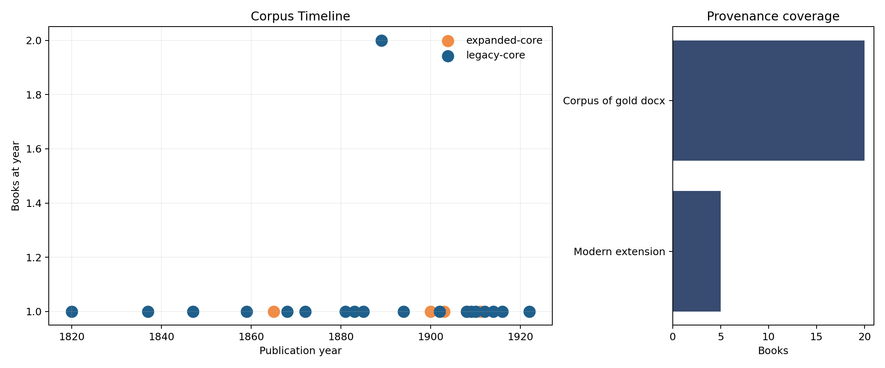
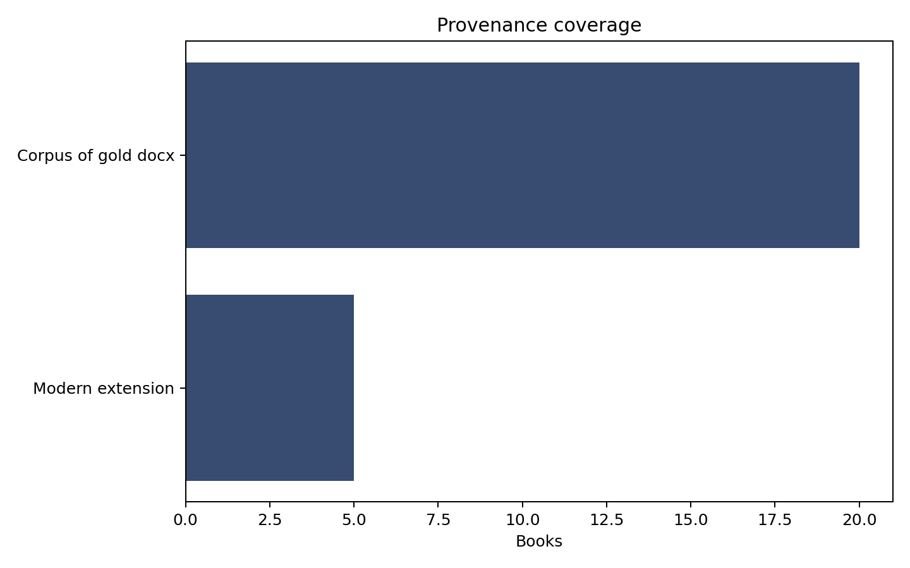
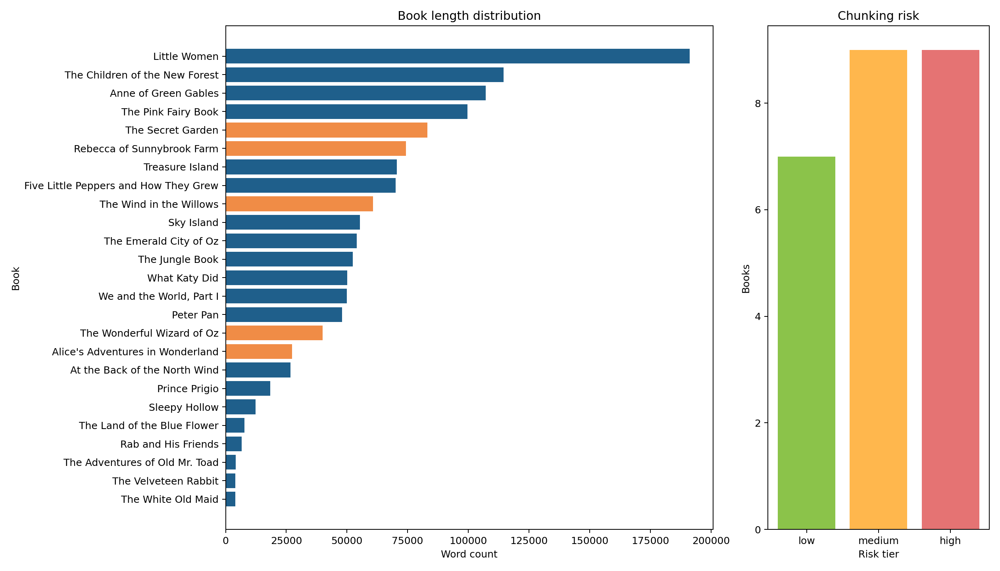
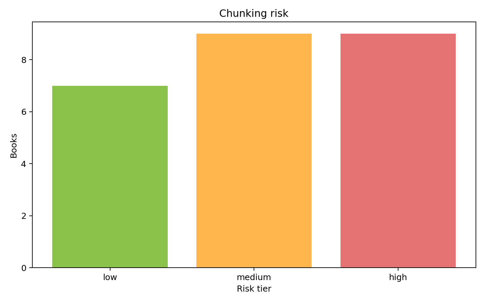
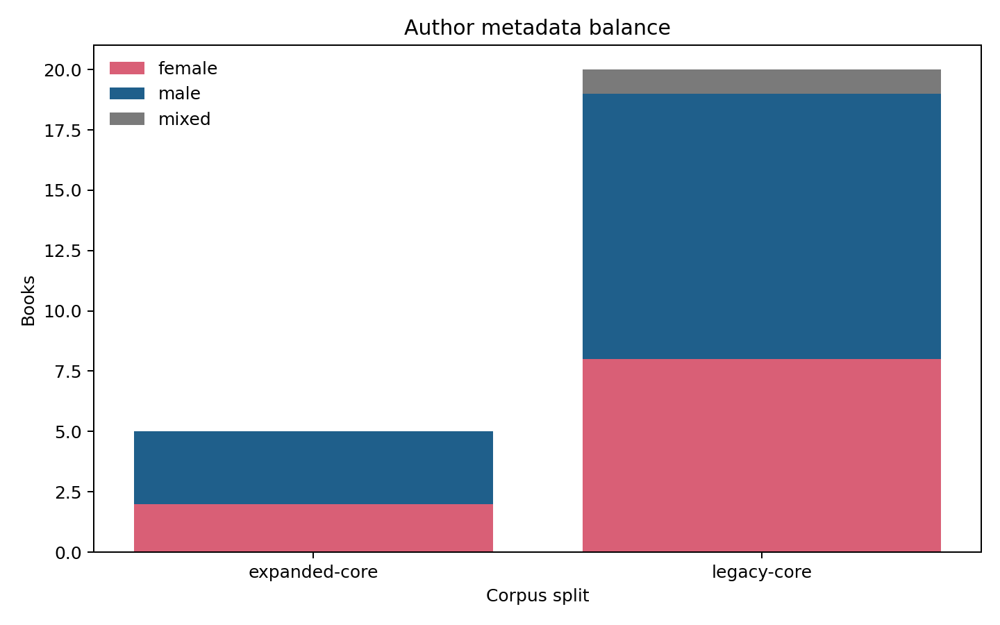
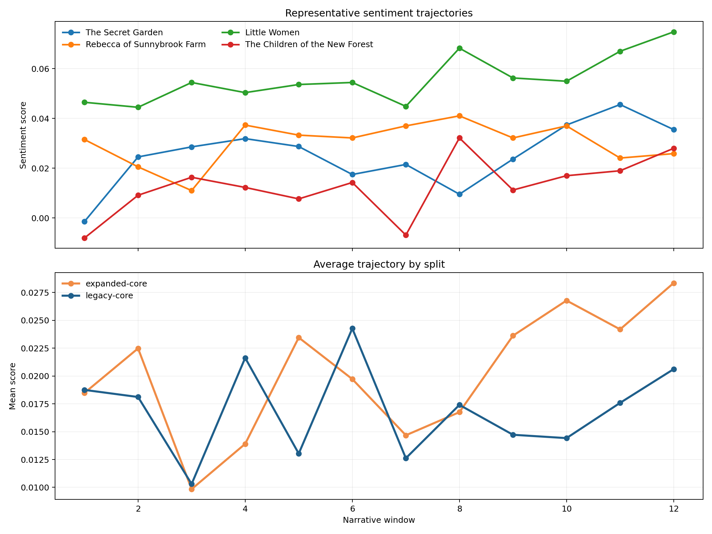
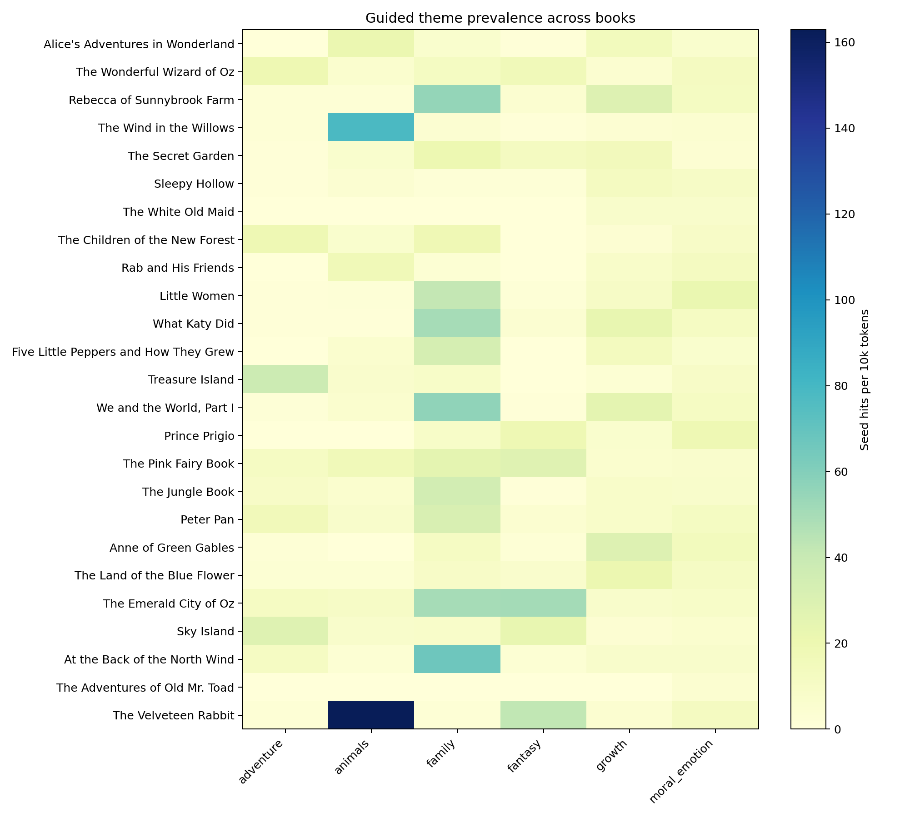
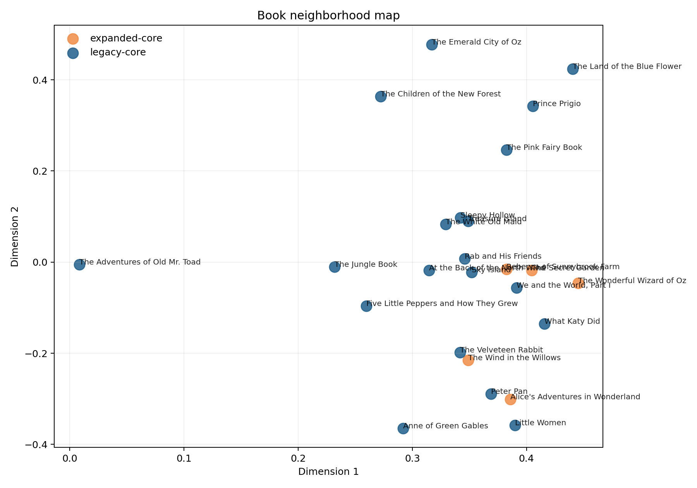
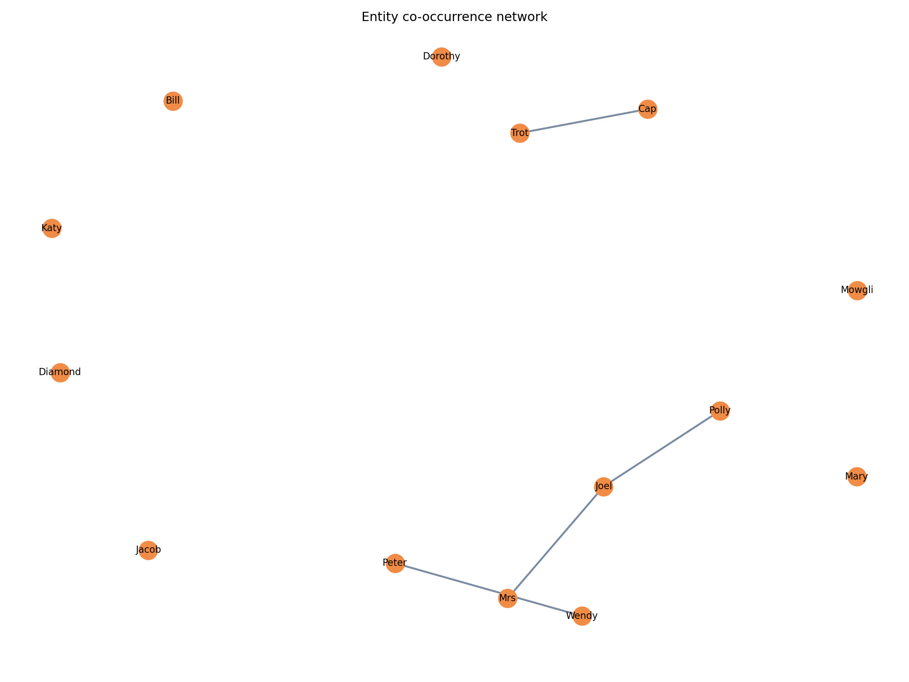
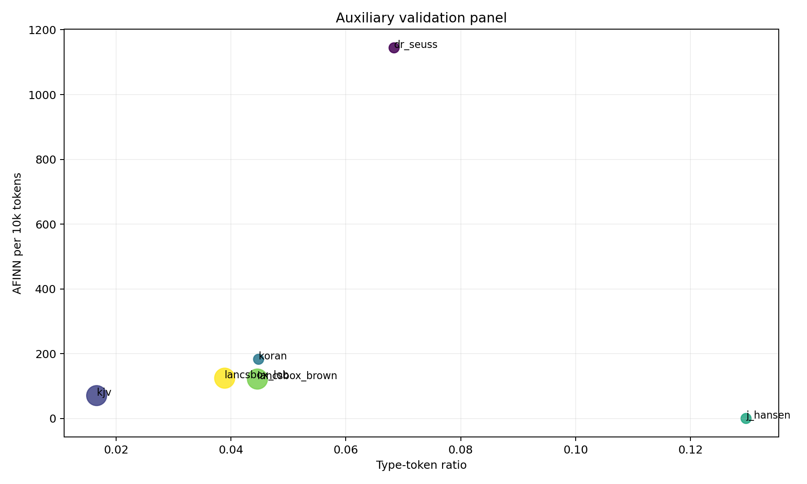

# Why this report exists

This report is the deeper public-release companion to `README.md`. It keeps the GitHub front page dense and practical while offering more context, larger tables, and a fuller explanation of how the rebuilt children’s literature workflow can be reused.

The interactive product surface now lives at [`https://aarhus-childrens-literature-toolkit.vercel.app`](https://aarhus-childrens-literature-toolkit.vercel.app), while this report stays focused on methodology, benchmark framing, and deeper reuse guidance.

The children’s literature focus is intentional rather than incidental: the corpus offers interpretable narrative structure, recurring characters, theme-rich plots, and public-domain availability that make it unusually useful for transparent text-mining workflows.

The current stack should be read as editorial and discovery intelligence rather than as a full story-forecasting system. It is already useful for comparing books, auditing corpora, surfacing thematic neighborhoods, and supporting recommendation/editorial workflows, but it does not yet justify a strong claim that it can predict plot outcomes or literary success.

The original 2016 teaching materials now live in [`../course_2016/README.md`](../course_2016/README.md), while this report stays focused on the modern public toolkit surface.

## Who this report is for

- Libraries and reading platforms that need better related-title navigation than age labels and manual subject tags alone.
- EdTech and curriculum teams that need interpretable evidence for themed lists, classroom comparison, and reading discovery.
- Secondary audiences such as researchers, teachers, publishers, and editors who want a transparent benchmark and evidence surface.

## Current Capability

- Rebuild a transparent children’s literature corpus from the 20-book legacy baseline plus a small modern expansion layer.
- Compare books through theme profiles, sentiment trajectories, recurring entities, and semantic neighborhoods.
- Audit corpus provenance, historical clustering, metadata balance, and processing constraints before making broader claims.
- Publish the outputs as reusable figures, tables, README/report surfaces, and release assets across both R and Python entrypoints.

## What It Cannot Yet Do

- It does not perform chapter-level or scene-level story forecasting.
- It does not provide a personalized reader model.
- It does not offer validated pedagogy scoring, reading-level scoring, or curriculum suitability labels.
- It does not predict market success, sales potential, or literary quality.

## MVP Product Shape

- A searchable children’s literature dashboard.
- A similar-title panel for related-book navigation.
- A theme profile panel for reading-list and shelf design.
- A sentiment arc viewer for narrative pacing comparison.
- A corpus bias and provenance audit panel for collection review.

## Primary User Workflow

1. Start from a known title, author, or reading theme.
2. Inspect neighboring books, theme profiles, character prominence, and sentiment pacing.
3. Compare titles before building a reading list, recommendation surface, or classroom collection.
4. Export or reuse the evidence in discovery, curation, and collection-audit workflows.

## Roadmap

- Phase 1: ship the current dashboard MVP using the existing similarity, theme, sentiment, entity, and corpus-audit outputs.
- Phase 2: add institution-facing tooling such as filters, cohort comparison, exportable reading lists, and stronger collection views.
- Phase 3: add sequence-aware modeling only after chapter-level structure, labels, and evaluation data exist.

## Why Not Story Prediction Yet

Story prediction is a different task from similarity, theme profiling, and pacing comparison. It would require chapter- or scene-level sequence data, explicit labels, and an evaluation loop that measures whether the model actually predicts future narrative events instead of just describing books retrospectively. The current repo does not have that validation layer yet, so it should not be marketed as a story-forecasting system.

## Shared entrypoints

```bash
make setup
make bootstrap
make python-assets
make readme
make report
```

```bash
python -m childlit_toolkit modern
Rscript scripts/run_targets.R modern
```

## Corpus summary

```{=markdown}
## Corpus Summary

- Total books: 25
- Total words: 1,332,482
- Legacy-core books: 20
- Expanded-core books: 5

| split         | n_books | total_words | median_book_words | mean_book_words | mean_afinn_per_10k | mean_type_token_ratio |
| ------------- | ------- | ----------- | ----------------- | --------------- | ------------------ | --------------------- |
| expanded-core | 5       | 285618      | 60770.0           | 57123.6         | 201.88             | 0.0874                |
| legacy-core   | 20      | 1046864     | 50005.0           | 52343.2         | 169.58             | 0.1353                |

```

## Visual analytics

### Timeline



- Signal: historical concentration in the current corpus.
- Decision: whether the collection is balanced enough for discovery or classroom use.
- Limit: this reflects the curated public-domain corpus, not the whole field.

### Provenance coverage



- Signal: source reliability and reconstruction transparency.
- Decision: whether a title is stable enough to expose in benchmark or dashboard views.
- Limit: provenance quality does not guarantee interpretive quality.

### Length distribution



- Signal: which titles are large enough to distort naive comparisons.
- Decision: whether to compare books as full texts, chapters, or windows.
- Limit: length is an engineering and comparability factor, not a quality signal.

### Chunking risk



- Signal: long-context processing pressure per title.
- Decision: which segmentation strategy is safe for a live dashboard pipeline.
- Limit: chunk counts depend on preprocessing and model context windows.

### Metadata balance



- Signal: representational imbalance in the current catalog.
- Decision: where to rebalance or qualify the collection before making broader claims.
- Limit: this depends on the available metadata fields and corpus scope.

### Sentiment trajectories



- Signal: narrative pacing over the course of a book.
- Decision: compare calmer versus more turbulent reading experiences for list building or classroom use.
- Limit: this is a pacing feature, not a literary-quality score.

### Guided theme heatmap



- Signal: title-level theme profiles for reading-list and discovery work.
- Decision: which books fit friendship, family, growth, fantasy, adventure, animals, or moral-emotion collections.
- Limit: the view is seed-guided, so it reflects the configured theme vocabulary.

### Semantic neighborhood



- Signal: related-title neighborhoods beyond flat subject tags.
- Decision: which adjacent books a library or reading platform should surface next.
- Limit: this is not personalized recommendation and depends on the embedding backend.

### Entity network



- Signal: whether a book is strongly character-driven and which names dominate it.
- Decision: which books are especially useful for character-centered discussion or comparison.
- Limit: fallback extraction is heuristic when the stronger local NER backend is unavailable.

### Auxiliary validation



- Signal: how the core corpus compares with local reference corpora.
- Decision: whether a new dashboard corpus looks unusually narrow or skewed before productization.
- Limit: these are calibration references, not replacements for the core benchmark.

## Legacy baseline

```{=markdown}
## Legacy 2016 Baseline

| cohort | min    | q1    | median | mean   | q3   | max   | perplexity |
| ------ | ------ | ----- | ------ | ------ | ---- | ----- | ---------- |
| men    | -245.0 | -41.0 | -3.0   | -13.76 | 23.0 | 195.0 | 3369.274   |
| women  | -232.0 | -21.0 | 9.0    | 13.88  | 54.0 | 190.0 | 4628.327   |

```

## Modern stack

```{=markdown}
## Modern Stack

| module                | status    | purpose                         | detail                                  |
| --------------------- | --------- | ------------------------------- | --------------------------------------- |
| transformers          | available | modern sentiment backend        | import ok                               |
| sentence_transformers | missing   | embedding and retrieval backend | No module named 'sentence_transformers' |
| bertopic              | missing   | embedding topic modeling        | No module named 'bertopic'              |
| gliner                | missing   | local named entity recognition  | No module named 'gliner'                |
| torch                 | available | accelerated local inference     | import ok                               |
| networkx              | available | entity co-occurrence graphing   | import ok                               |

### Benchmark Framing

| component              | repo_metric                                                   | legacy_2016_baseline                                    | external_reference                              | published_reference_or_sota        | comparability_note                                                                |
| ---------------------- | ------------------------------------------------------------- | ------------------------------------------------------- | ----------------------------------------------- | ---------------------------------- | --------------------------------------------------------------------------------- |
| Sentiment              | afinn-fallback; mean window score 0.02                        | AFINN cohort means: men -13.76 / women 13.88            | distilbert-base-uncased-finetuned-sst-2-english | Official model card only           | No directly comparable literary benchmark in the local archive.                   |
| Topic modeling         | Guided themes + sklearn LDA; mean dominant topic share 0.844  | topicmodels::LDA perplexity men 3,369.3 / women 4,628.3 | bertopic                                        | Method docs only                   | Cross-corpus SOTA numbers are not directly comparable to this literary corpus.    |
| NER                    | heuristic-titlecase; top-10 entity mean density 41.60 per 10k | Incomplete openNLP sketch                               | gliner                                          | Upstream docs                      | Local entity density and co-occurrence are project-specific.                      |
| Embeddings / retrieval | tfidf-fallback; mean top-1 neighbor cosine 0.151              | not available                                           | Qwen/Qwen3-Embedding-0.6B                       | Model card / MTEB-style references | Neighbor quality is corpus-specific; external numbers are only reference context. |

### Corpus Snapshot

| corpus_split  | n_books | total_words | mean_words_per_book | median_words_per_book | mean_afinn_per_10k_tokens | mean_type_token_ratio |
| ------------- | ------- | ----------- | ------------------- | --------------------- | ------------------------- | --------------------- |
| expanded-core | 5       | 285618      | 57123.6             | 60770.0               | 201.88                    | 0.0874                |
| legacy-core   | 20      | 1046864     | 52343.2             | 50005.0               | 169.58                    | 0.1353                |

```

## Release bundle

```{=markdown}
## Release Bundle

| path                                         | exists | bytes   |
| -------------------------------------------- | ------ | ------- |
| site/data/dashboard.json                     | True   | 173585  |
| README.md                                    | True   | 42192   |
| data/manifests/corpus_manifest.csv           | True   | 7317    |
| data/manifests/local_assets.csv              | True   | 129404  |
| data/manifests/legacy_summary.csv            | True   | 142     |
| site/index.html                              | True   | 1010    |
| site/assets/app.css                          | True   | 13176   |
| site/assets/app.js                           | True   | 48882   |
| site/assets/favicon.svg                      | True   | 723     |
| public/index.html                            | True   | 1010    |
| public/dashboard/index.html                  | True   | 812     |
| public/report/index.html                     | True   | 12399   |
| results/tables/benchmark_overview.csv        | True   | 229     |
| results/tables/benchmark_sota_comparison.csv | True   | 982     |
| results/tables/dependency_license_audit.csv  | True   | 1019    |
| docs/report.qmd                              | True   | 14050   |
| docs/index.html                              | True   | 12399   |
| results/assets/hero.gif                      | True   | 2121466 |
| results/assets/hero.mp4                      | True   | 604844  |

```

## Reuse guidance

1. Update `config/corpus_seed.csv` with a new children’s literature corpus.
2. Adjust `config/theme_seeds.yml` if the thematic frame changes.
3. Rebuild the assets.
4. Review the benchmark framing table before making public claims.

This is the intended SOP value of the repo: a reusable public workflow, not just a single archived analysis.
